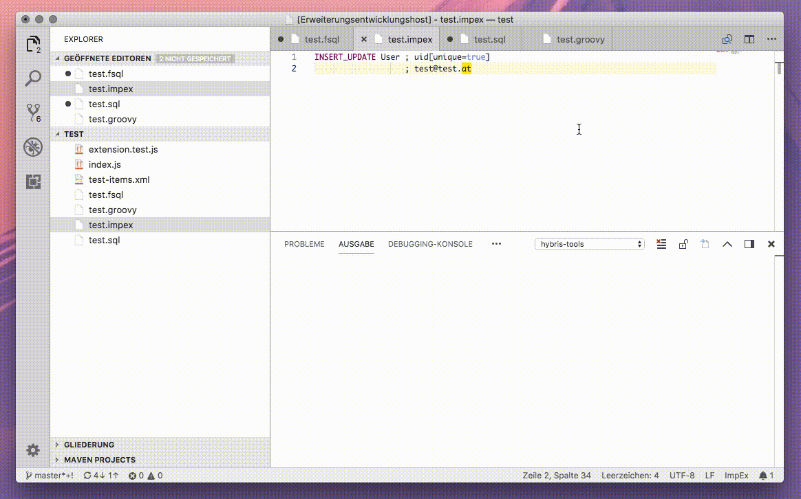
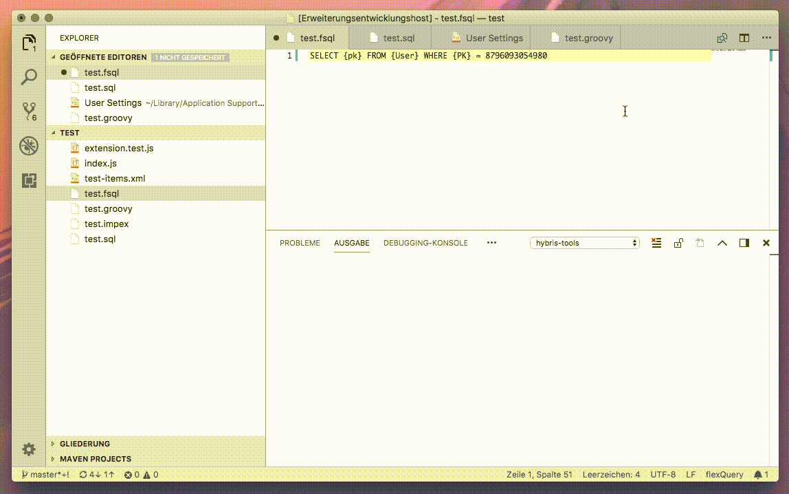
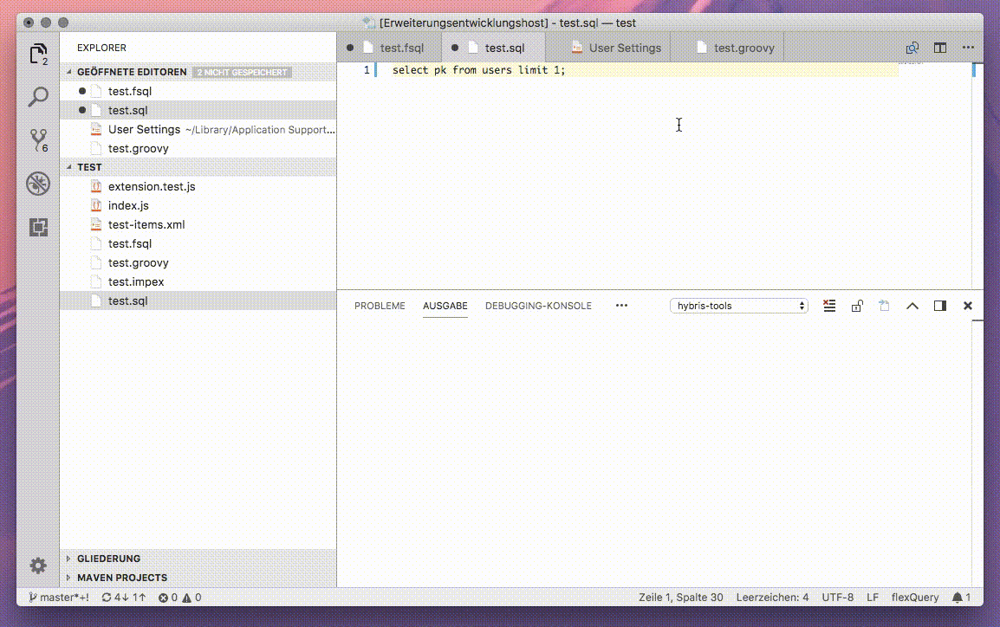
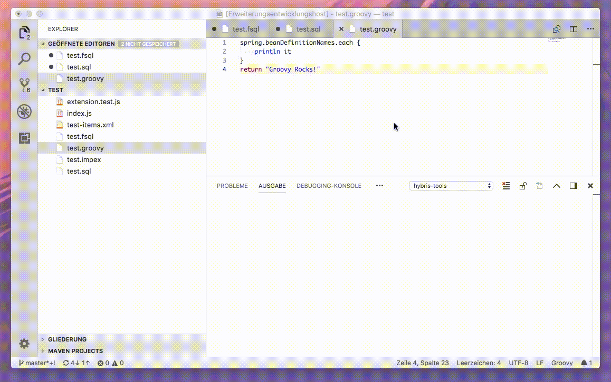

# vscode-hybris-tools README

This vscode extension adds several useful commands related to SAP hybris development:
* Validate ImpEx from the editor
* Import ImpEx from the editor
* Run Groovy scripts
* Run Flexible Search queries and raw SQL queries from the editor
* Run PK analyzer

For syntax highlighting this extension is recommended: [ImpEx support](https://github.com/simplyRoba/ImpExSupport).

## Screenshots

## Extension Settings

This extension contributes the following settings:

* `hybris.hac.url`: the url to the local hybris HAC extension
* `hybris.hac.username`: the hybris HAC user name
* `hybris.hac.password`: the hybris HAC user password
* `hybris.hac.http.timeout`: the HTTP socket timeout. 

## Future ideas
* Support multiple hybris HAC endpoints
* Display Flxible Search result in separate window (possibly with further filtering tools)
* Auto-setup for workspace (dependency resolution)
* Start init/update from command palette

## Known Issues

* Output/feedback still a bit clunky

## Disclaimer
I'm not affiliated with SAP in any way. The logo and names are probably trademarks. I hope it's OK to use them. If not, please don't hesitate to contact me (but don't sue me!).